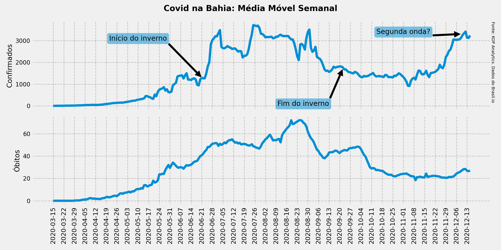

# Análise do COVID na Bahia
## >>Favor abrir notebook pelo link do colab para interação completa com os mapas

Este notebook analisa os dados da COVID-19 disponibilizados pelo portal Brasil.io através deste [link](https://brasil.io/dataset/covid19/caso/).

Os dados são apresentados diariamente pelas secretarias estaduais e municipais de saúde e coletados/compilados pela equipe de voluntarios do Brasil.io. Aqui foram analisados os dados desde o começo da pandemia até a primeira quinzena de Dezembro.

Este estudo visa analisar especificamente a situação do estado da Bahia e suas microrregiões, ou, regiões intermediárias e imediatas. Segundo o IBGE, as microrregiões *"são agrupamentos de regiões imediatas que são articuladas através da influência de uma metrópole, capital regional ou centro urbano representativo dentro do conjunto"*. Por determinação da nova nomenclatura do IBGE, chamaremos estas áreas de regiões intermediárias e imediatas.

Dentro de um mesmo estado podem existir realidades bem distintas entre as subdivisões. Para um estado de grandes proporções como a Bahia pode ser mais interessante analisarmos cada região dessa para que o governo estadual possa alocar recursos onde mais se precisa, atuando efetivamente contra os efeitos da pandemia.

O IBGE dividiu a Bahia em 32 regiões intermediárias e imediatas e nosso estudo vai se basear fazendo um comparativo entre as mesmas. 

No entanto, antes de dar um zoom em cada subdivisão da Bahia, vamos contextulizar a situação nacional fazendo os seguintes comparativos:

1. entre as 5 regiões do Brasil;
2. entre os estados do Nordeste;
Os indicadores comparados serão:

1. confirmados por 100 mil;
2. óbitos por 100 mil;
3. taxa de mortalidade; 
A divisão por 100 mil habitantes facilita um comparativo mais justo respeitando as devidas proporcionalidades.

Ou seja, faremos um zoom de forma gradual começando no cenário nacional até chegar nas regiões intermediárias e imediatas da Bahia.

## Mapa interativo

Foi feito um mapa interativo onde é possível acompanhar a evolução da COVID na Bahia desde o início até se disseminar por todo o estado. Acesse este [link](https://kpxto.github.io/mapa-covid/) para visualizar.

## Segunda onda?

Uma das principais conclusões é que o risco de uma segunda onde é real, com número de casos confirmados voltando para os mesmos níveis de pico da pandemia, conforme pode ser notado na imagem abaixo. A imagem também mostra que época do ano, como inverno, não é fator primordial para o agravamento da crise já que houve uma subida muito forte de novos casos na primeira quinzena de Dezembro, época de calor e aproximação do verão. 

## Bibliotecas utilizadas

* Pandas     - analise de dados
* Numpy      - algebra linear e base da bilbioteca Pandas
* Seaborn    - gráficos para visualização de dados
* Matplotlib - gráficos para visualização de dados e base da lib Seaborn
* Folium     - para trabalhos com mapas
